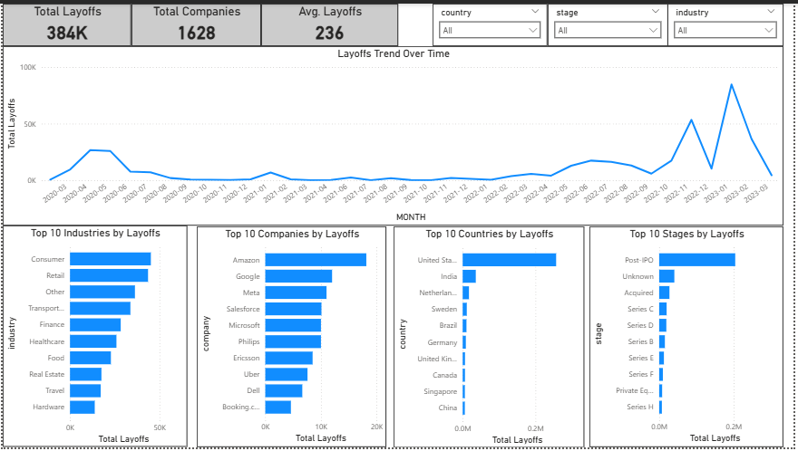
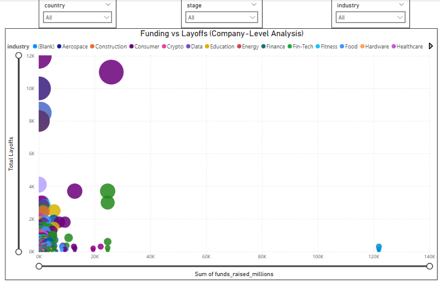

# layoffs_data_analysis

## Project Overview
This project analyzes global layoffs data to uncover trends, company impact, and the relationship between funding and layoffs.  

The analysis was performed using **MySQL for data cleaning & exploration** and **Power BI for visualization and storytelling**.

## Objectives
- Analyze layoffs trends over time  
- Identify top impacted companies, industries, and countries  
- Understand how funding relates to layoffs  
- Build an interactive dashboard for insights  

## Tools & Technologies
- **MySQL** – Data cleaning and transformation  
- **Power BI** – Dashboard creation and visualization  
- **Excel (CSV)** – Data validation  

## Data Cleaning (MySQL)
- Removed duplicate records using `ROW_NUMBER()`  
- Standardized columns (industry, country, dates)  
- Converted data types (date, percentages)  
- Handled null and missing values  
- Created a cleaned dataset for analysis  

## Exploratory Data Analysis
- Total layoffs by company, country, and industry  
- Yearly, monthly, and quarterly trends  
- Funding vs layoffs relationship  
- Layoffs distribution across funding stages  
- Cumulative layoffs over time  

## Dashboard Preview

### Main Dashboard


### Scatter Analysis (Funding vs Layoffs)


## Key Insights
- Certain industries like **Consumer and Retail** experienced the highest layoffs  
- Layoffs peaked during specific time periods, indicating economic shifts  
- Highly funded companies also conducted large layoffs  
- Majority of companies fall into low funding and low layoffs clusters  
- A few outliers show extremely high funding but comparatively low layoffs  

## Repository Structure

```
layoffs_data_analysis/
│
├── mysql/
│ ├── layoffs_raw.csv
│ ├── data_cleaning.sql
│ ├── analysis.sql
│
├── powerbi/
│ ├── layoffs_dashboard.pbix
│ ├── dashboard_view.png
│ ├── scatter_view.png
│
└── README.md
```


## How to Use
1. Run the SQL scripts to clean and explore the dataset  
2. Open the Power BI file (`.pbix`)  
3. Interact with the dashboard and explore different filters  

## Acknowledgement
This project was inspired by a data cleaning tutorial by Alex The Analyst, which provided the dataset and initial cleaning approach.

The exploratory data analysis and Power BI dashboard were developed independently to extend the analysis and build a complete end-to-end project.

## About Me
Hi, I’m Misbah Sultana, a Clinical Research Associate with experience in data analysis, currently transitioning into data analytics.
I have worked with real-world clinical data to derive insights and identify patterns, and I’m now strengthening my skills in SQL and Power BI through hands-on projects.

Connect with me on LinkedIn: [Misbah Sultana](https://www.linkedin.com/in/misbansultana55)